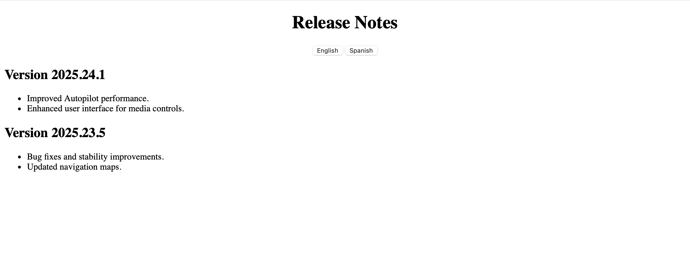

# Release Notes Viewer

This is a simple, static web application that displays release notes and supports internationalization (i18n) using the `i18next` library.

It allows users to:
- View release notes in English and Spanish
- Dynamically update the interface by switching languages
- Understand how localization work

---

## Project Structure

release-notes-viewer/
├── index.html
├── main.js
├── locales/
│ ├── en.json
│ └── es.json

---

## How to Run It Locally (with Live Server in VS Code)

> This assumes you have [VS Code](https://code.visualstudio.com/) installed.

### Step-by-Step:

1. **Clone or Download the Repo**  
   Clone via GitHub or download the ZIP and extract it.

2. **Open the Folder in VS Code**

3. **Install the Live Server Extension**  
   Go to the **Extensions** tab (left sidebar) → search for **Live Server** by Ritwick Dey → click **Install**.

4. **Right-click `index.html` → “Open with Live Server”**

5. Your default browser will open at something like:  
http://127.0.0.1:5500/index.html

6. Use the **language buttons** to toggle between English and Spanish release notes.

---

## Tech Used

- HTML, JavaScript
- [`i18next`](https://www.i18next.com/) for internationalization
- JSON for storing localized release notes
- Optional: `i18next-http-backend` to load translations from `/locales` (refer main.js to see how to implement it.)

---

## 📸 Preview

> 

---